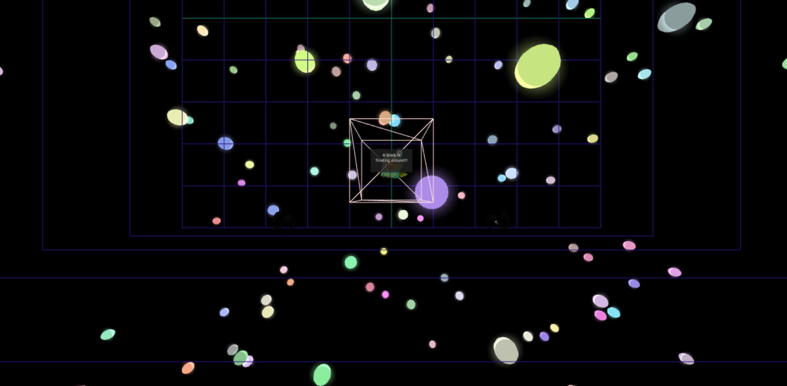
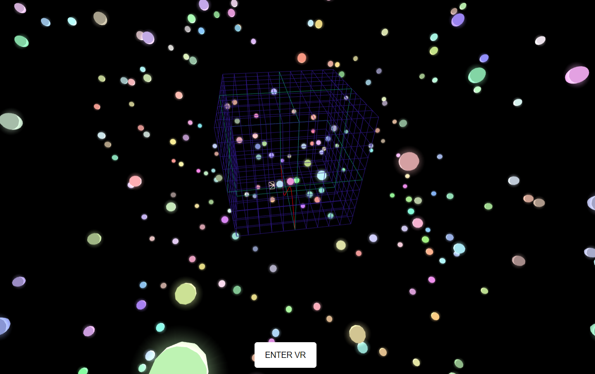

# A hobby website for audio visualization with Virtual Reality technology enabled.

Please note that this website is created for the purpose of learning how to enable 3D Websites with VR Technology, and for me to learn how the sequence and code work.
## Thus, the code is not written in the best, optimized / clean way so its is not a proper convention to follow for projects but it will be redone properly in the future!

The website works best with an Oculus Quest and its controllers.

* The right controller select button is in charge of interacting with interactable objects / other actions in the 3D space
* The left controller select button is in charge of looping, starting and pausing songs
* Use the right controller joystick to move forward / backwards, and left / right relative to the direction your camera is facing
* Use the left controller joystick to move up or down vertically on the y-axis of your VR Body

# Examples of the website

